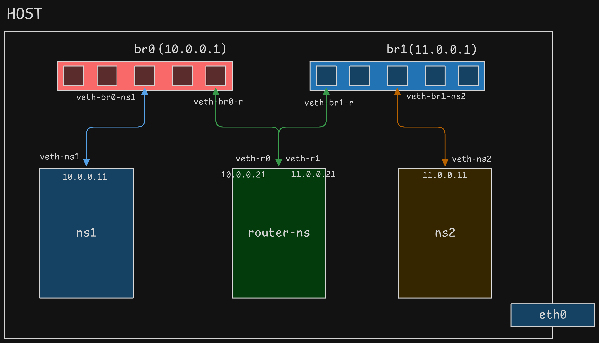

# Linux Network Namespace Simulation Assignment

## Overview

This project demonstrates how to simulate two isolated networks connected via a router using *Linux network namespaces, bridges, and virtual Ethernet (veth) interfaces*.

## Network Diagram



## IP Addressing Scheme

| Component | Interface | IP Address | Subnet      |
| --------- | --------- | ---------- | ----------- |
| ns1       | veth-ns1  | 10.0.0.11  | 10.0.0.0/24 |
| ns2       | veth-ns2  | 11.0.0.11  | 11.0.0.0/24 |
| router-ns | veth-r0   | 10.0.0.21  | 10.0.0.0/24 |
| router-ns | veth-r1   | 11.0.0.21  | 11.0.0.0/24 |

## Routing Configuration

1. ns1:

    ```sh
    default via 10.0.0.1
    ```

2. ns2:

    ```sh
    default via 11.0.0.1
    ```

3. router-ns:

    - Connected to both subnets directly
    - IP forwarding enabled:

    ```sh
    net.ipv4.ip_forward = 1
    ```

## Prerequisites

- Linux operating system
- Root or sudo access
- Packages

```sh
sudo apt update
sudo apt upgrade -y
sudo apt install iproute2
sudo apt install net-tools
```

## Step 1: Create Network Bridges

```sh
sudo ip link add dev br0 type bridge
sudo ip link add dev br1 type bridge
```

To verify that our bridges were created:

```sh
sudo ip link show
```

The bridges are in DOWN State. To make them into UP state:

```sh
sudo ip link set dev br0 up
sudo ip link set dev br1 up
```

Assign IP address to the bridges:

```sh
sudo ip addr add 10.0.0.1/24 dev br0
sudo ip addr add 11.0.0.1/24 dev br1
```

Verify our assigned IPs:

```sh
sudo ip addr show br0
sudo ip addr show br1
```

## Step 2: Create Network Namespaces

```sh
sudo ip netns add ns1
sudo ip netns add ns2
sudo ip netns add router-ns
```

Verify our namespaces has been created:

```sh
sudo ip netns list
```

## Step 3: Create Virtual Ethernet Pairs

```sh
sudo ip link add veth-ns1 type veth peer name veth-br0-ns1
sudo ip link add veth-ns2 type veth peer name veth-br1-ns2

sudo ip link add veth-r0 type veth peer name veth-br0-r
sudo ip link add veth-r1 type veth peer name veth-br1-r
```

Verify our veth pairs has been created:

```sh
sudo ip link show
```

## Step 4: Connect Interfaces

Move each end of the veth cables to their respective namespaces and bridges:

```sh
# ns1 <-> br0
sudo ip link set dev veth-ns1 netns ns1
sudo ip link set dev veth-br0-ns1 master br0

# ns2 <-> br1
sudo ip link set dev veth-ns2 netns ns2
sudo ip link set dev veth-br1-ns2 master br1

# router-ns <-> br0
sudo ip link set dev veth-r0 netns router-ns
sudo ip link set dev veth-br0-r master br0

# router-ns <-> br1
sudo ip link set dev veth-r1 netns router-ns
sudo ip link set dev veth-br1-r master br1
```

Verify our changes:

```sh
sudo ip link show
```

```sh
sudo ip netns exec ns1 ip link show
sudo ip netns exec ns2 ip link show
sudo ip netns exec router-ns ip link show
```

## Step 5: Bring Interfaces UP

Set the bridge interfaces UP:

```sh
sudo ip link set dev veth-br0-ns1 up
sudo ip link set dev veth-br1-ns2 up
sudo ip link set dev veth-br0-r up
sudo ip link set dev veth-br1-r up
```

Verify changes:

```sh
sudo ip link show
```

Set the loopback interfaces UP inside namespaces:

```sh
sudo ip netns exec ns1 ip link set lo up  
sudo ip netns exec ns2 ip link set lo up  
sudo ip netns exec router-ns ip link set lo up
```

Set the namespace interfaces UP:

```sh
sudo ip netns exec ns1 ip link set dev veth-ns1 up
sudo ip netns exec ns2 ip link set dev veth-ns2 up
sudo ip netns exec router-ns ip link set dev veth-r0 up
sudo ip netns exec router-ns ip link set dev veth-r1 up
```

Verify changes:

```sh
sudo ip netns exec ns1 ip link show
sudo ip netns exec ns2 ip link show
sudo ip netns exec router-ns ip link show
```

## Step 6: Assign IP & Routing

Assign IP addresses to virtual interfaces within each namespace and set default routes.

```sh
sudo ip netns exec ns1 ip address add 10.0.0.11/24 dev veth-ns1
sudo ip netns exec ns1 ip route add default via 10.0.0.21

sudo ip netns exec ns2 ip address add 11.0.0.11/24 dev veth-ns2
sudo ip netns exec ns2 ip route add default via 11.0.0.21

sudo ip netns exec router-ns ip address add 10.0.0.21/24 dev veth-r0
sudo ip netns exec router-ns ip address add 11.0.0.21/24 dev veth-r1
```

Check route tables:

```sh
sudo ip netns exec ns1 route
sudo ip netns exec ns2 route
sudo ip netns exec router-ns route
```

## Step 7: Enable Routing

```sh
sudo ip netns exec router-ns sysctl -w net.ipv4.ip_forward=1
```

## Step 8: Firewall Rules

```sh
sudo iptables --append FORWARD --in-interface br0 --jump ACCEPT
sudo iptables --append FORWARD --out-interface br0 --jump ACCEPT

sudo iptables --append FORWARD --in-interface br1 --jump ACCEPT
sudo iptables --append FORWARD --out-interface br1 --jump ACCEPT
```

## Step 9: Test Connectivity

1. ns1 -> router

    ```sh
    sudo ip netns exec ns1 ping 10.0.0.1
    ```

2. ns2 -> router

    ```sh
    sudo ip netns exec ns2 ping 11.0.0.1
    ```

3. ns1 -> ns2:

    ```sh
    sudo ip netns exec ns1 ping -c 3 11.0.0.11
    ```

4. ns2 -> ns1:

    ```sh
    sudo ip netns exec ns2 ping -c 3 10.0.0.11
    ```

**Expected Results:**

- ns1 can reach router
- ns2 can reach router
- ns1 can reach ns2

## Step 10: Cleanup

```sh
sudo ip netns del ns1
sudo ip netns del ns2
sudo ip netns del router-ns
sudo ip link del br0
sudo ip link del br1
```

Verify:

```sh
sudo ip netns list
sudo ip link show
```
